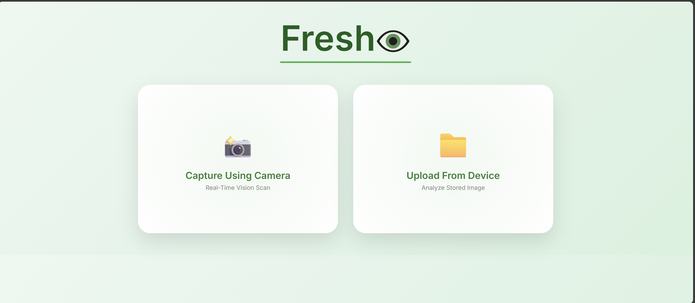
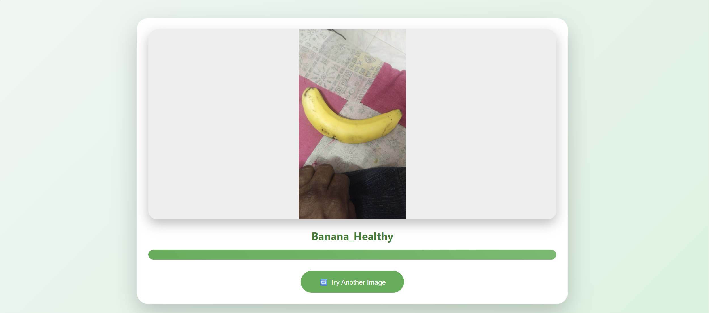

# 👁️ FreshEye AI Vision Console

FreshEye AI Vision Console is a deep learning web application that detects whether fruits and vegetables are **Healthy or Rotten** using VGG16 Transfer Learning.

---

## 🚀 Features

- 📸 Real-time Camera Capture
- 📁 Upload from Device
- 🖼 Image Preview Before Prediction
- 📊 Confidence Percentage Meter
- 🧠 VGG16 Transfer Learning Model
- 🎨 Modern AI Vision Interface

---

## 🧠 Model Details

- Base Model: VGG16 (ImageNet Pretrained)
- Fine-Tuning: Last 4 Layers Unfrozen
- Optimizer: Adam
- Loss: Categorical Crossentropy
- Input Size: 224x224
- Classes: 28 (Healthy & Rotten Categories)

---

## 🛠 Tech Stack

- Python (Flask)
- TensorFlow / Keras
- HTML / CSS
- JavaScript
- Git & GitHub

---

## 📂 Project Structure

FreshEye-AI-Vision/
│
├── app.py
├── train_model.py
├── templates/
│   ├── index.html
│   ├── camera.html
│   ├── preview.html
│   └── output.html
├── static/
│   └── uploads/
└── healthy_vs_rotten.h5 (not uploaded)

---

## 🧪 How to Run

```bash
pip install -r requirements.txt
python app.py

---

## 📸 Demo

### 🏠 Home Page


### 📸 Preview Page


### 📊 Prediction Result


---

## 👨‍💻 Author

Sheik Abdul Rafiqullah  
B.Tech – AI/ML Project  
